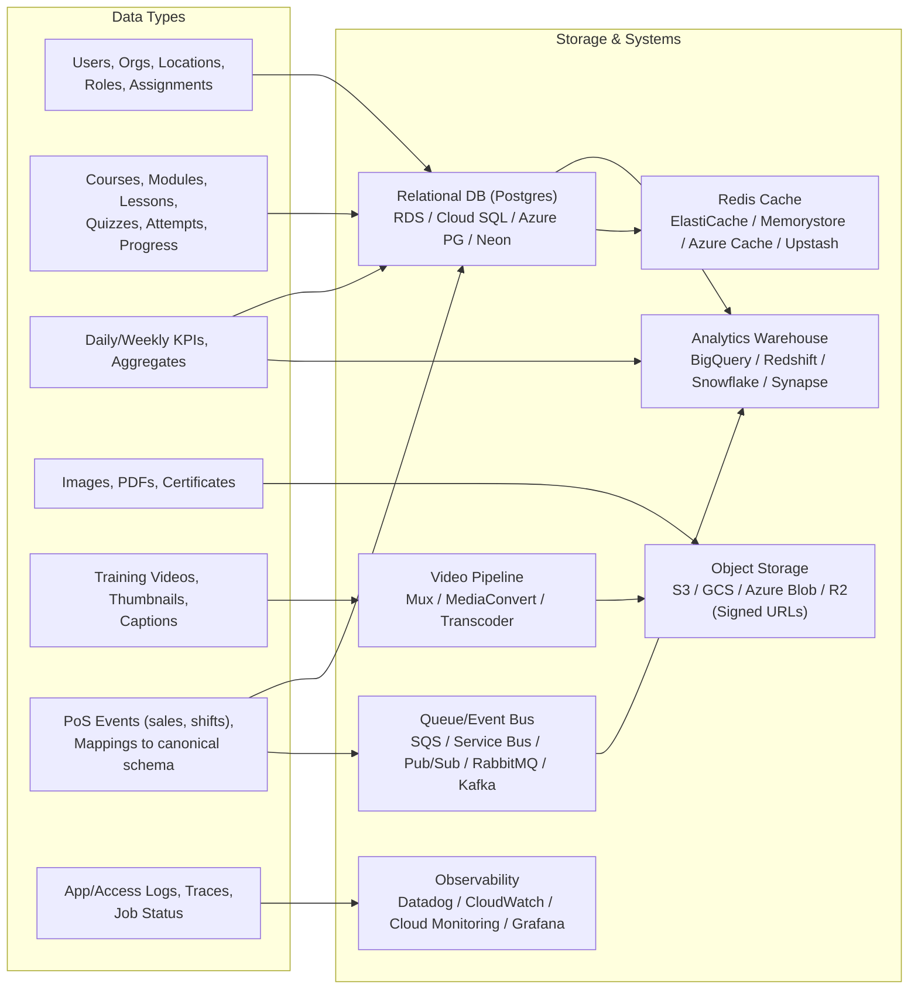

```mermaid

flowchart LR
  subgraph Types["Data Types"]
    Users["Users, Orgs, Locations,\nRoles, Assignments"]
    Training["Courses, Modules, Lessons,\nQuizzes, Attempts, Progress"]
    KPIs["Daily/Weekly KPIs, Aggregates"]
    Images["Images, PDFs, Certificates"]
    Video["Training Videos, Thumbnails,\nCaptions"]
    POS["PoS Events (sales, shifts),\nMappings to canonical schema"]
    Logs["App/Access Logs, Traces,\nJob Status"]
  end

  subgraph Stores["Storage & Systems"]
    SQL["Relational DB (Postgres)\nRDS / Cloud SQL / Azure PG / Neon"]
    Cache["Redis Cache\nElastiCache / Memorystore / Azure Cache / Upstash"]
    OBJ["Object Storage\nS3 / GCS / Azure Blob / R2\n(Signed URLs)"]
    Media["Video Pipeline\nMux / MediaConvert / Transcoder"]
    Queue["Queue/Event Bus\nSQS / Service Bus / Pub/Sub / RabbitMQ / Kafka"]
    WH["Analytics Warehouse\nBigQuery / Redshift / Snowflake / Synapse"]
    OBS["Observability\nDatadog / CloudWatch / Cloud Monitoring / Grafana"]
  end

  %% mappings
  Users --> SQL
  Training --> SQL
  POS --> SQL
  POS --> Queue
  KPIs --> SQL
  KPIs --> WH
  Images --> OBJ
  Video --> Media
  Media --> OBJ
  Logs --> OBS

  %% derived flows
  SQL --> WH
  Queue --> WH
  SQL --> Cache

```
